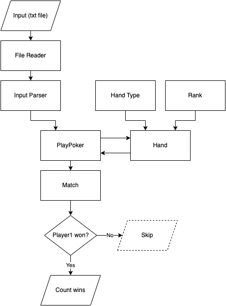

# Poker hands
## Problem 54
[Resource](https://projecteuler.net/problem=54)

---

### How the solution works:
Input is from txt file.  
Main program is in Main class.  
Output is shown in console window.

---
### OOP ideas:
* abstraction 
  * interface
* encapsulation
  * private members
* polymorphism
  * method overriding in few implementation of interface
* association
  * Match -> 2 Hands
  * Hand -> 5 Cards
* aggregation
  * no circular dependencies
* composition
  * Hand is composed of Cards
  * Combined is created from 2 other hand type classes
---
### What I like and do not like about my solution:
#### Like:
* no need to write a lot of ifs for all possible ranks combinations in a match
* no royal flush rank
#### Not like:
* it was hard to test parsing from `List<List<Card>>` to `List<Match>` without any getter
* too much rank classes
* `HandType` could have been an abstract class to not repeat `getRank` and `getHighestCardValue` methods
---
### New to me:
* poker rules
* `Comparator.comparing`, `Collections.singletonList` classes and methods
* case classes in Java are records 